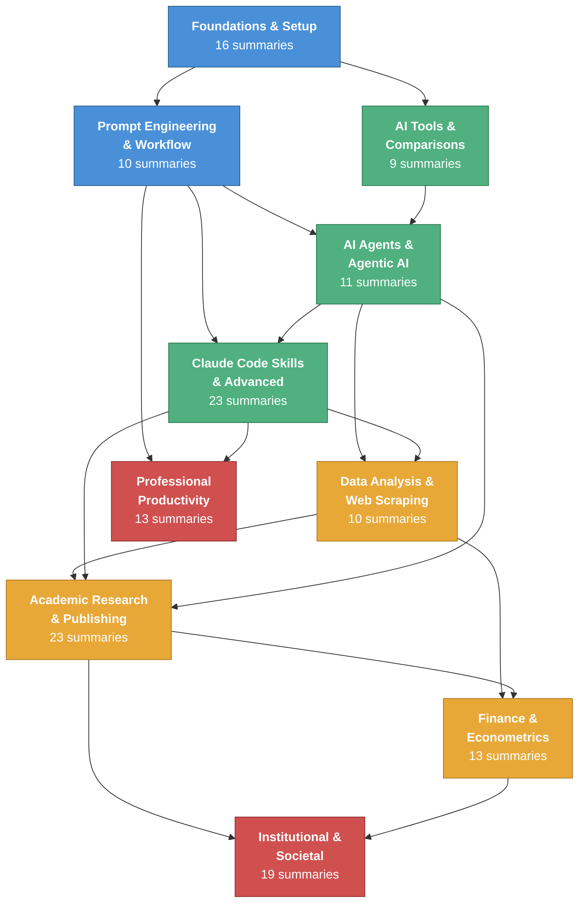

# Category Map

A visual map of how the ten knowledge-base categories relate to one another. Arrows indicate primary knowledge-flow direction (foundational → applied).

## Reading the Map

| Color | Layer | Categories |
|-------|-------|------------|
| Blue | **Foundational** | Foundations & Setup, Prompt Engineering & Workflow |
| Green | **Technical** | AI Agents, Claude Code Skills, AI Tools & Comparisons |
| Orange | **Applied** | Data Analysis, Academic Research, Finance & Econometrics |
| Red | **Big Picture** | Institutional & Societal, Professional Productivity |

**Suggested reading order:** Start with the blue (foundational) categories, then explore the green (technical) layer, and finally move to orange (applied) and red (big-picture) topics.

## Category Links

- [[summaries/foundations-setup|Foundations & Setup]]
- [[summaries/prompt-engineering-workflow|Prompt Engineering & Workflow]]
- [[summaries/ai-agents|AI Agents & Agentic AI]]
- [[summaries/claude-code-skills|Claude Code Skills & Advanced]]
- [[summaries/ai-tools|AI Tools & Comparisons]]
- [[summaries/data-analysis|Data Analysis & Web Scraping]]
- [[summaries/academic-research|Academic Research & Publishing]]
- [[summaries/finance-econometrics|Finance & Econometrics]]
- [[summaries/institutional-societal|Institutional & Societal]]
- [[summaries/professional-productivity|Professional Productivity]]
